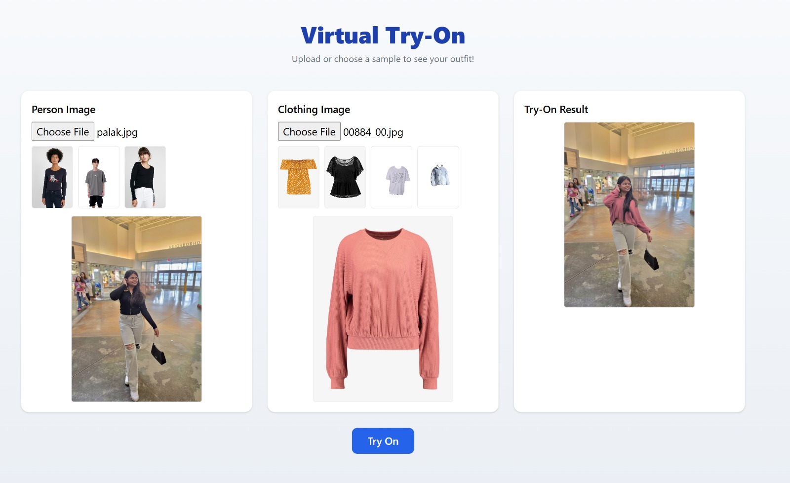

# 👗 AI-Powered Virtual Try-On System

This project showcases a virtual try-on system that lets users upload a person image and a clothing item image to generate a realistic try-on output — all powered by deep learning.

---

## 📌 Features

- Upload person & garment images via a web interface
- Warps the clothing item to match body pose
- Outputs realistic blended images using GMM & TOM models
- Clean React-based frontend with live preview
- Feedback form embedded for user input

---

## 🧠 How It Works

The system consists of the following stages:

1. **Pose Estimation** – Using OpenPose to extract body keypoints
2. **Cloth Segmentation** – Using U2Net & ResNet101 to extract cloth masks
3. **GMM (Geometric Matching Module)** – Warps the cloth to fit the pose
4. **TOM (Try-On Module)** – Synthesizes the final try-on image with realistic blending

---

## 🧾 Dataset

We used the **DeepFashion2** dataset, which contains:

- 📦 ~491,000 person images
- 👕 801,000 clothing items in 13 categories
- 🧷 Key Annotations:
  - Bounding boxes
  - Pose landmarks
  - Segmentation masks
  - Attributes like occlusion, style, and view

We split the dataset as:
- Training: 391K
- Validation: 34K
- Testing: 67K

---

## 🧼 Preprocessing Pipeline

- Image standardization and normalization (256×256 or 256×192)
- Cropped images using bounding boxes
- Segmentation masks cleaned or generated (MPV dataset used a parser)
- Pose extraction via OpenPose
- JSON annotation conversion and filtering

---

## ✨ Example Output



---

## 💻 Demo

To run locally:

```bash
# Backend
python manage.py runserver

# Frontend
cd frontend/
npm install
npm start
